# CafeMenu

<p align="center">
  <strong>Multi-tenant QR menü yönetim platformu</strong><br>
  Kafeler ve restoranlar için merkezi yönetim, rol bazlı yetkilendirme, özelleştirilebilir dijital menü ve QR erişimi.
</p>

<p align="center">
  
  
  
  
  
  
  
</p>

> **Public showcase repository:** Bu repository CafeMenu projesinin ürün, mimari ve arayüz tanıtımı için hazırlanmıştır. Uygulamanın tam kaynak kodu, deployment scriptleri, internal geliştirme dokümantasyonu ve test kaynakları public olarak paylaşılmamaktadır.

---

## 📌 İçindekiler

- [Proje Hakkında](#-proje-hakkında)
- [Çözülen Problem](#-çözülen-problem)
- [Sistemin Çalışma Mantığı](#-sistemin-çalışma-mantığı)
- [Roller ve Yetkilendirme](#-roller-ve-yetkilendirme)
- [Multi-Tenant Yapı](#-multi-tenant-yapı)
- [Teknik Mimari](#-teknik-mimari)
- [İstek Akışı](#-istek-akışı)
- [Veri Modeli ve Temel İlişkiler](#-veri-modeli-ve-temel-ilişkiler)
- [Temel Özellikler](#-temel-özellikler)
- [Kullanılan Teknolojiler](#-kullanılan-teknolojiler)
- [Güvenlik Yaklaşımı](#-güvenlik-yaklaşımı)
- [Docker ve Production Yaklaşımı](#-docker-ve-production-yaklaşımı)
- [Ekran Görüntüleri](#-ekran-görüntüleri)
- [Public Repository Yapısı](#-public-repository-yapısı)
- [Testler](#-testler)
- [V1 Kapsamı](#-v1-kapsamı)

---

## 🎯 Proje Hakkında

**CafeMenu**, Türkiye'deki kafe ve restoranlar için geliştirilmiş, production odaklı **multi-tenant QR menü SaaS platformudur**.

Sistem tek bir işletmeye özel tasarlanmamıştır. Her kafe bağımsız bir **tenant** olarak ele alınır ve aynı uygulama üzerinde birden fazla işletme çalışırken her işletmenin yönetim verileri diğer tenant'lardan izole edilir.

Platform yöneticisi sistemdeki kafeleri ve kullanıcı atamalarını yönetir. Kafe sahibi veya kafe yöneticisi kendi yetkili olduğu işletmenin kategorilerini, ürünlerini, fiyatlarını, görünürlüğünü, yayın durumunu ve marka görünümünü yönetebilir. Son müşteri ise herhangi bir hesap oluşturmadan QR kod üzerinden işletmenin yayınlanmış dijital menüsüne erişir.

Public menü adresi:

```text
/c/{slug}
```

Örnek:

```text
/c/mocca-cafe
```

CafeMenu'nun temel amacı, menü ve marka yönetimini kaynak kod değişikliğine ihtiyaç duymadan işletme kullanıcılarına bırakırken, platform seviyesinde tenant izolasyonunu ve merkezi yönetimi korumaktır.

---

## 💡 Çözülen Problem

Klasik dijital menü çözümlerinde işletme verisinin, kullanıcı yetkilerinin ve menü görünümünün tek bir yapı içinde güvenli biçimde ayrıştırılması zorlaşabilir.

CafeMenu bu problemi üç ayrı kullanım katmanına ayırır:

1. **Platform yönetimi:** Kafelerin ve platform kullanıcılarının merkezi olarak yönetilmesi.
2. **Kafe yönetimi:** Her işletmenin yalnızca kendi kategorilerini, ürünlerini, görünümünü ve yayın ayarlarını yönetmesi.
3. **Public müşteri deneyimi:** Müşterinin login olmadan QR kod üzerinden sadece yayınlanmış menü içeriğini görmesi.

Bu sayede yönetim tarafı ile public menü birbirinden ayrılır; tenant verileri server-side yetkilendirme ile korunur.

---

## 🔄 Sistemin Çalışma Mantığı

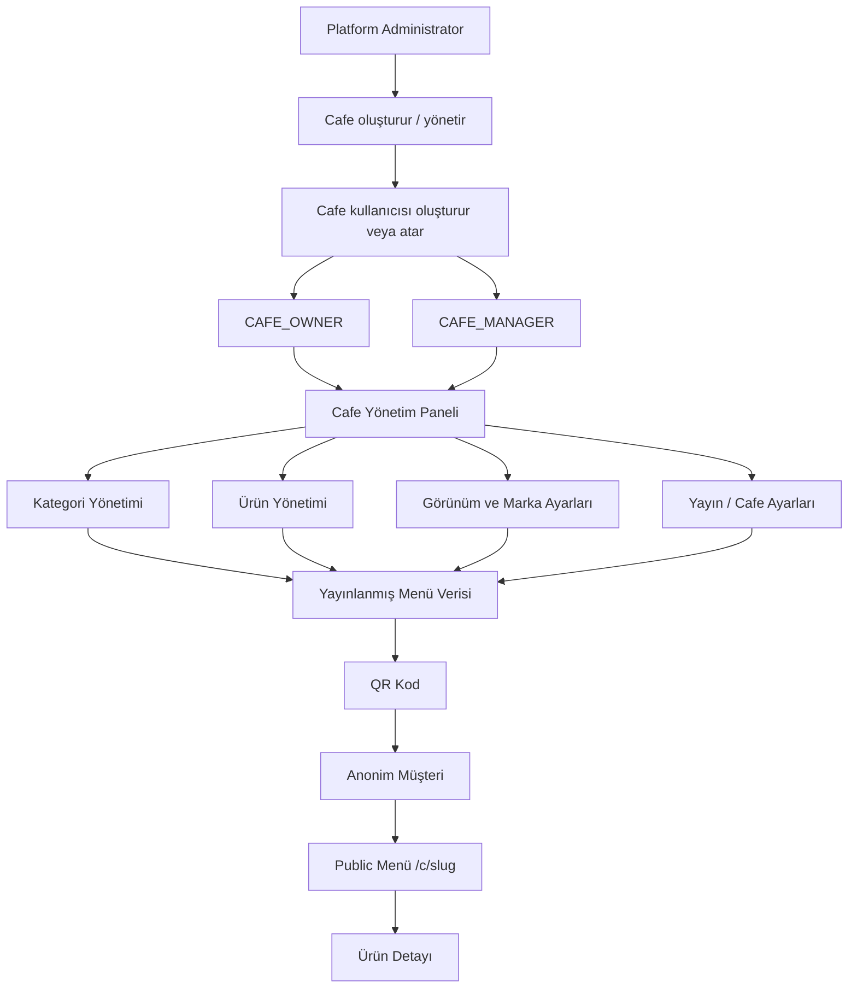

### Uçtan uca senaryo

**1. Platform Administrator**
- Yeni bir kafe oluşturur.
- Kafeyi aktif/pasif duruma getirebilir.
- Kafe kullanıcılarını oluşturur veya mevcut kullanıcıları kafeye bağlar.
- Kullanıcıya `CAFE_OWNER` veya `CAFE_MANAGER` rolü atar.

**2. Cafe Owner / Cafe Manager**
- Yetkili olduğu kafenin yönetim paneline erişir.
- Kategorileri ve ürünleri yönetir.
- Ürün fiyatı, açıklaması, görseli, görünürlüğü ve stok/uygunluk durumunu değiştirir.
- Logo, kapak görseli, tema, font ve renk ayarlarını düzenler.
- Menüyü yayınlar.
- Public menü için QR kod üretir.

**3. Anonymous Public Customer**
- Herhangi bir hesap oluşturmaz.
- QR kodu okutur.
- `/c/{slug}` üzerinden public menüyü açar.
- Kategoriler arasında gezinir.
- Ürün arar.
- Fiyatları ve ürün detaylarını görüntüler.

---

## 👥 Roller ve Yetkilendirme

CafeMenu başlangıçta üç yönetim rolü kullanır.

### `PLATFORM_ADMIN`

Platform seviyesindeki sistem yöneticisidir.

Başlıca sorumlulukları:

- Cafe oluşturma ve listeleme
- Cafe aktif/pasif yönetimi
- Cafe sahibi/yöneticisi oluşturma veya atama
- Platform seviyesindeki temel cafe bilgilerini yönetme

`PLATFORM_ADMIN` cafe membership rolü değildir; platform seviyesindedir.

### `CAFE_OWNER`

Cafe seviyesindeki sahip rolüdür.

- Yetkili olduğu cafeleri yönetir.
- Menü ve cafe ayarlarında geniş yönetim yetkisine sahiptir.
- Bir kullanıcı birden fazla cafeye bağlı olabilir.
- Sahiplik doğrudan tek bir cafe kullanıcı alanına bağlı değildir; membership modeli üzerinden temsil edilir.

### `CAFE_MANAGER`

Cafe seviyesindeki yönetici/çalışan rolüdür.

- Atandığı cafe kapsamında izin verilen menü kaynaklarını yönetir.
- Yetki modeli gelecekte yeni permission/policy ihtiyaçları eklenebilecek şekilde membership yapısı üzerine kuruludur.

### Anonymous Public Customer

Müşteri hesabı yoktur.

- Kayıt gerekmez.
- Login gerekmez.
- Public menu doğrudan cafe slug'ı üzerinden açılır.
- Private administration verilerine erişemez.

---

## 🏢 Multi-Tenant Yapı

CafeMenu'da **bir cafe = bir tenant** olarak modellenir.

Cafe'ye ait tenant verileri arasında:

- Branding / tema bilgileri
- Kategoriler
- Ürünler
- Ürün ve kategori görsel referansları
- QR menü ayarları
- Audit kayıtları

bulunur.

Temel membership ilişkisi:

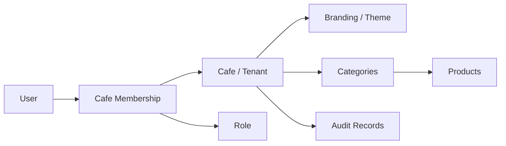

Bu modelin önemli sonucu:

> **Bir kullanıcı = bir cafe** varsayımı yapılmaz.

Bir kullanıcı birden fazla cafe için üyeliğe sahip olabilir. Cafe erişimi, client tarafından gönderilen cafe kimliğine güvenilerek değil; authenticated user, aktif membership, rol/policy ve resource ownership kontrolleriyle server-side olarak doğrulanır.

### Cross-Tenant Koruma

Cafe A için yetkili bir kullanıcının:

- Cafe B kategorilerini okuması
- Cafe B ürünlerini değiştirmesi
- Cafe B kaynaklarını silmesi
- Cafe A ürününü Cafe B kategorisine bağlaması
- Cafe B private yönetim verisini görmesi

engellenir.

Tenant izolasyonu CafeMenu'nun güvenlik açısından kritik gereksinimlerinden biridir.

---

## 🏗️ Teknik Mimari

CafeMenu, **layered architecture** kullanan bir modular monolith yaklaşımına sahiptir.

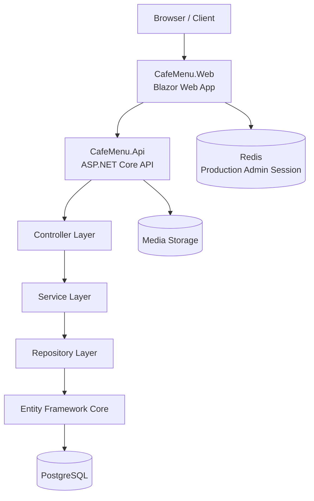

### `CafeMenu.Web`

Blazor Web App tabanlı web katmanıdır.

Başlıca alanlar:

- Account / Authentication
- Platform Administration
- Cafe Administration
- Categories
- Products
- Branding / Appearance
- QR Management
- Public Menu

Yönetim UI'ı ile public customer menü route'ları birbirinden ayrılmıştır.

### `CafeMenu.Api`

ASP.NET Core backend uygulamasıdır.

Sorumlulukları:

- Authentication / authorization
- Platform administration
- Cafe membership
- Cafe management
- Category management
- Product management
- Branding
- Public menu
- Image/file operations
- PostgreSQL persistence
- Tenant authorization
- Health checks
- Rate limiting
- Security validation

### Layer Responsibilities

```text
Controller
    ↓
Service
    ↓
Repository
    ↓
Entity Framework Core
    ↓
PostgreSQL
```

- **Controller:** HTTP request/response ve request DTO'ları.
- **Service:** İş kuralları, business validation, authorization koordinasyonu ve transaction boundary.
- **Repository:** Veri erişimi ve EF Core sorguları.
- **EF Core:** PostgreSQL persistence.
- **Mapperly:** Entity ↔ DTO mapping.
- **Global Exception Handling:** Standart hata cevaplarının merkezi yönetimi.

---

## 📡 İstek Akışı

Tipik bir API isteği aşağıdaki akıştan geçer:

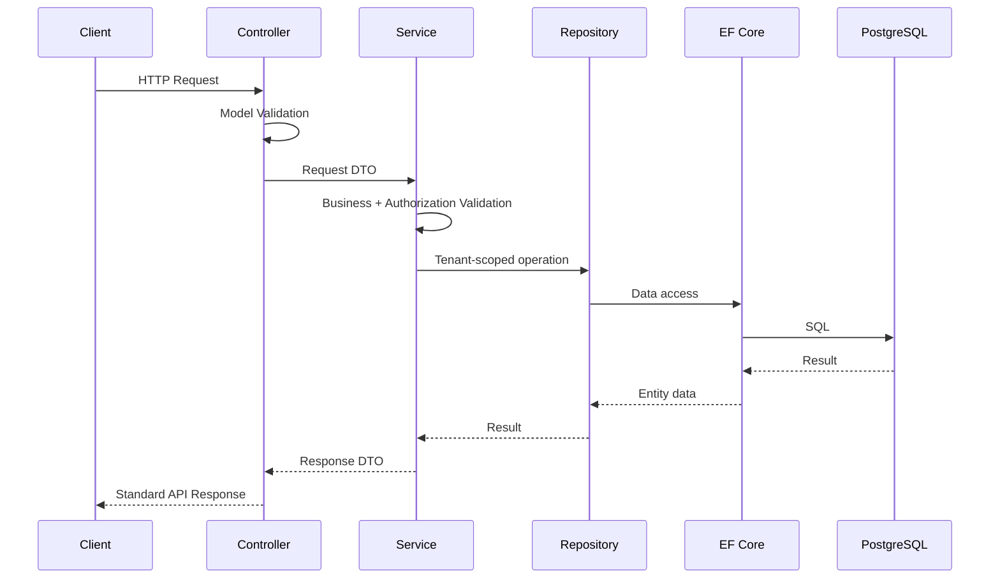

---

## 🗃️ Veri Modeli ve Temel İlişkiler

Ana domain kavramları:

| Domain | Amaç |
|---|---|
| User | Yönetim kullanıcı hesabı |
| Role | Platform ve cafe rol tanımları |
| Cafe | Tenant root |
| Cafe Membership | User ↔ Cafe ↔ Role ilişkisi |
| Cafe Theme | Cafe'ye özel kontrollü branding ayarları |
| Category | Cafe menü kategorisi |
| Product | Cafe menü ürünü |
| Refresh Token | Revocable refresh token persistence |
| Audit Log | Anlamlı yönetim olaylarının kaydı |

### Public veri filtreleme

Public menüde yalnızca uygun içerikler gösterilir.

Cafe:
- Active
- Published
- Not deleted

Category:
- Visible
- Published
- Not deleted

Product:
- Visible
- Published
- Not deleted

Geçici olarak unavailable olan ürünler, public visibility kurallarını sağlıyorsa **tükendi / mevcut değil** durumu ile gösterilebilir.

---

## ✨ Temel Özellikler

### Platform Yönetimi

- Çoklu cafe yönetimi
- Cafe oluşturma
- Cafe aktif/pasif durumu
- Cafe kullanıcısı oluşturma
- Owner / Manager atama
- Kullanıcı setup/onboarding akışı

### Cafe Yönetimi

- Cafe dashboard
- Temel istatistikler
- Cafe ayarları
- Yayın durumu
- Slug tabanlı public menu
- Tenant-scoped yönetim

### Kategori Yönetimi

- Kategori oluşturma
- Güncelleme
- Soft delete
- Görünür/gizli durumu
- Sıralama
- Opsiyonel kategori görseli

Kategoriler source code içine hard-code edilmez; tamamen data-driven çalışır.

### Ürün Yönetimi

- Ürün oluşturma ve güncelleme
- Ürün açıklaması
- Türk Lirası fiyat yönetimi
- Ürünü kategoriye bağlama
- Görsel yükleme
- Görünürlük
- Yayın durumu
- Sıralama
- Available / unavailable durumu
- Soft delete

### Branding / Appearance

Her cafe kendi public menüsünü kontrollü ayarlarla özelleştirebilir:

- Logo
- Cover image
- Primary color
- Secondary color
- Accent color
- Background color
- Text color
- Welcome title
- Welcome description
- Font preset
- Theme preset
- Canlı önizleme

Kullanıcı tarafından arbitrary HTML, CSS veya JavaScript çalıştırılmasına izin verilmez.

### Public QR Menu

- Authentication gerektirmez
- Mobile-first yapı
- Responsive tasarım
- Cafe branding
- Category navigation
- Product search
- Product detail
- Fiyat gösterimi
- Availability durumu

### QR Yönetimi

V1'de her cafe için genel public menu QR kodu bulunur.

Desteklenen çıktı formatları:
- PNG
- SVG

---

## 🧰 Kullanılan Teknolojiler

### Backend

| Teknoloji | Kullanım |
|---|---|
| **C#** | Ana uygulama dili |
| **.NET 10** | Runtime / SDK |
| **ASP.NET Core 10** | API, authentication, authorization, middleware |
| **Entity Framework Core** | ORM ve persistence |
| **Npgsql** | PostgreSQL provider |
| **Mapperly** | Entity ↔ DTO mapping |
| **BCrypt** | Password hashing |
| **JWT** | API access / refresh token authentication |

### Web

| Teknoloji | Kullanım |
|---|---|
| **Blazor Web App** | Admin ve public web arayüzü |
| **ASP.NET Core Data Protection** | Admin cookie protection |
| **Server-side admin session** | Backend token'larını browser storage dışında tutma |

### Data & Infrastructure

| Teknoloji | Kullanım |
|---|---|
| **PostgreSQL** | Ana relational database |
| **Redis** | Production admin session token store |
| **Docker** | Containerization |
| **Docker Compose** | Infrastructure orchestration |
| **Replaceable File Storage** | Cafe ve ürün görselleri |

### Testing

| Teknoloji | Kullanım |
|---|---|
| **xUnit** | Test framework |
| **Integration Tests** | Kritik auth / tenant / infrastructure akışları |
| **ASP.NET Core test infrastructure** | API ve configuration validation |

---

## 🔐 Güvenlik Yaklaşımı

CafeMenu'da güvenlik sadece UI seviyesinde uygulanmaz. Yetki kontrolleri backend tarafında gerçekleştirilir.

### Authentication

- ASP.NET Core Authentication
- JWT access token
- JWT refresh token
- BCrypt password hashing
- Revocable refresh token modeli

### Admin Session

CafeMenu.Web backend JWT token'larını browser JavaScript'e veya browser storage'a vermez.

Browser cookie'sinde authenticated user claims ve opaque session identifier bulunur. Access ve refresh token'lar server-side session store içinde tutulur.

- Development: `Memory`
- Production-like environment: `Redis`

### Authorization

- Role-based authorization
- Policy-based authorization
- Cafe membership kontrolü
- Tenant-scoped resource authorization
- Resource ownership kontrolü

UI'da bir butonun gizlenmesi güvenlik olarak kabul edilmez; backend policy kontrolleri zorunludur.

### Rate Limiting

Sensitive authentication/setup endpoint'lerinde ASP.NET Core fixed-window rate limiting kullanılır.

Korunan alanlara örnekler:
- Login
- Refresh token
- Account setup
- Platform user setup

Rate-limit reddi `429 Too Many Requests` döner.

### Security Headers

API ve Web tarafında temel browser güvenlik header'ları uygulanır:

- `X-Content-Type-Options: nosniff`
- `Referrer-Policy: strict-origin-when-cross-origin`
- `X-Frame-Options: SAMEORIGIN`
- `Permissions-Policy`
- CSP `frame-ancestors`

### Host Filtering

Production-like ortamlarda explicit `AllowedHosts` zorunludur. Wildcard (`*`) host kabulü production ortamında kullanılmaz.

### File Upload Security

Image upload akışında extension, MIME/content type, file signature, maximum size ve safe/generated storage path kontrolleri uygulanır. Normal image binary'leri PostgreSQL içinde tutulmaz.

### Secrets

Production secret'ları source code içine yazılmaz; deployment ortamı üzerinden yönetilir.

---

## 🐳 Docker ve Production Yaklaşımı

CafeMenu Docker tabanlı deployment yaklaşımına sahiptir.

Temel servisler:

```text
CafeMenu.Web
CafeMenu.Api
PostgreSQL
Redis
```

### Container Security

API ve Web runtime image'ları non-root kullanıcıyla çalışacak şekilde tasarlanmıştır.

### Persistent State

Production ortamında özellikle şu state'ler kalıcı storage gerektirir:

- PostgreSQL
- Media files
- Redis / session altyapısı
- ASP.NET Core Data Protection key ring

### Database Migrations

Production database migration'ları uygulama startup'ında otomatik çalıştırılmaz. Schema değişiklikleri version-controlled EF Core migration'larıyla kontrollü deployment sürecinde uygulanır.

### Health Probes

API ve Web, liveness ve readiness kontrolleri sağlar. Readiness kontrolleri ilgili dependency'lerin kullanılabilirliğini doğrular.

---

# 🖼️ Ekran Görüntüleri

## 1. Yönetici Girişi

Platform ve cafe yönetim kullanıcılarının sisteme giriş yaptığı authentication ekranı.

<p align="center">
  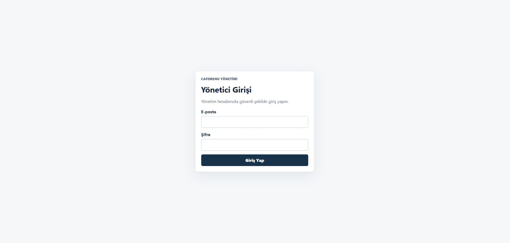
</p>

---

## 2. Platform Cafe Yönetimi

Platform Administrator tarafından sistemdeki cafelerin görüntülendiği ve platform seviyesinde yönetildiği ekran.

<p align="center">
  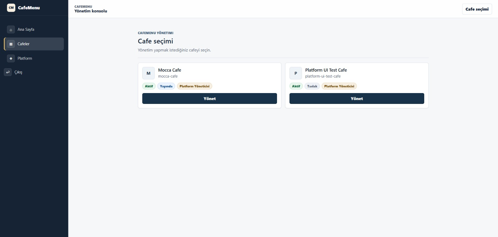
</p>

---

## 3. Cafe Owner Yönetim Paneli

Cafe Owner'ın kendi işletmesine ait temel istatistikleri ve yönetim alanlarını gördüğü dashboard.

<p align="center">
  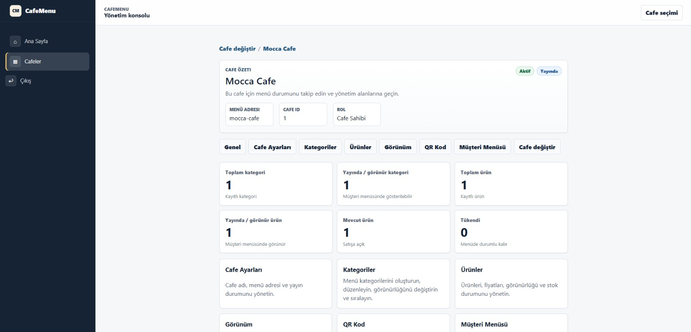
</p>

---

## 4. Ürün Yönetimi

Cafe'ye ait ürünlerin kategori, fiyat, görünürlük ve availability bilgileriyle yönetildiği ekran.

<p align="center">
  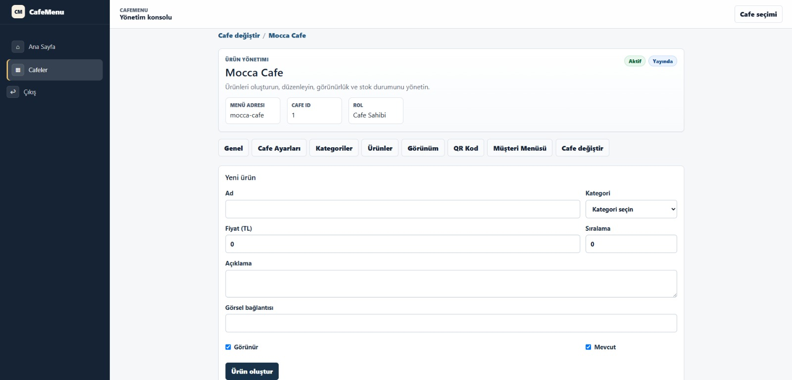
</p>

---

## 5. Logo ve Kapak Görseli Yönetimi

Cafe'nin public menüsünde kullanılacak logo ve cover image içeriklerinin yönetimi.

<p align="center">
  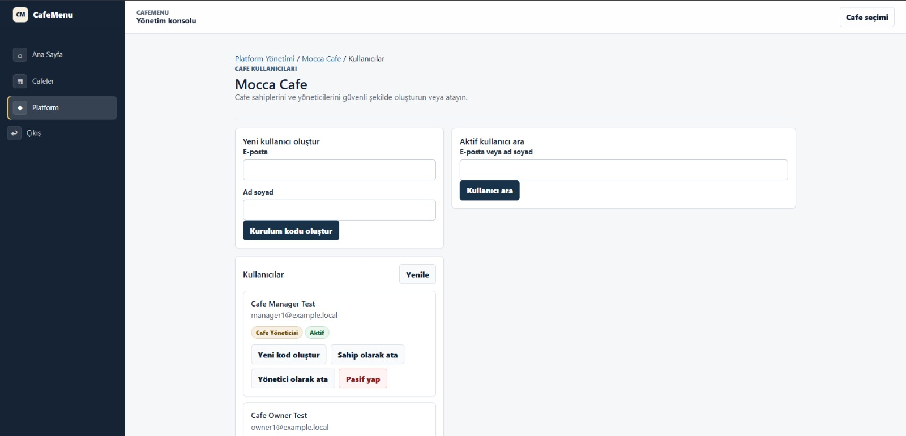
</p>

---

## 6. Tema, Renk ve Canlı Önizleme

Cafe'nin font, tema, renk paleti ve karşılama alanlarının kontrollü preset'lerle özelleştirildiği görünüm yönetimi.

<p align="center">
  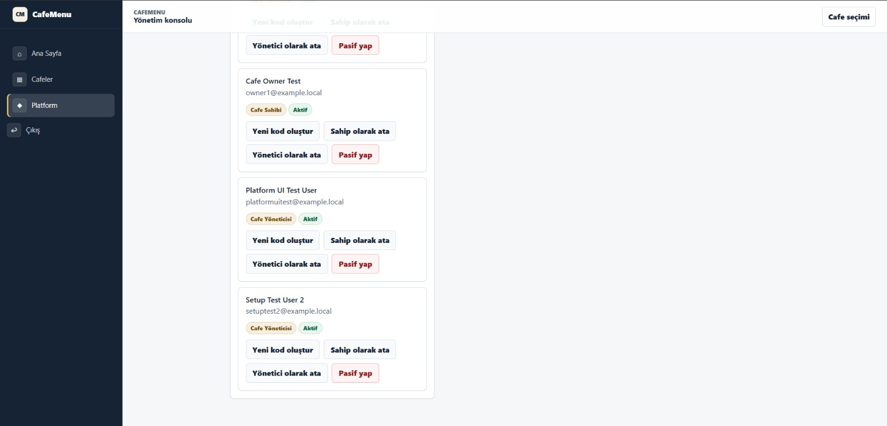
</p>

---

## 7. QR Kod Yönetimi

Cafe public menu URL'si için QR kodun görüntülendiği ve PNG/SVG olarak indirilebildiği yönetim ekranı.

<p align="center">
  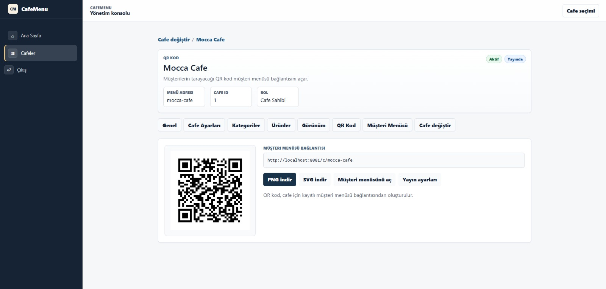
</p>

---

## 8. Public Müşteri Menüsü

Müşterinin herhangi bir authentication işlemine ihtiyaç duymadan QR kod üzerinden eriştiği mobile-first public menü.

<p align="center">
  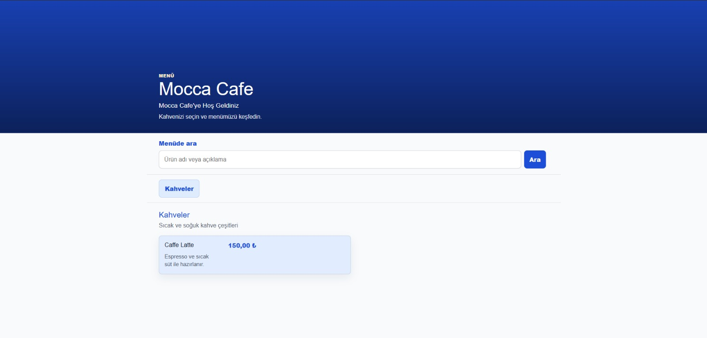
</p>

---

## 📁 Public Repository Yapısı

Bu public repository yalnızca proje tanıtımı için gerekli içerikleri barındırır:

```text
CafeMenu/
├── README.md
└── docs/
    └── images/
        └── UI screenshots
```

Tam uygulama source code'u, internal `.md` dokümantasyonu, test kaynakları, migration dosyaları, deployment scriptleri ve environment yapılandırmaları bu public görünümde yer almaz.

---

## 🧪 Testler

Proje özellikle güvenlik ve tenant izolasyonu gibi kritik davranışlar için geniş bir test altyapısına sahiptir.

Test kapsamına örnekler:

- Authentication
- Authorization
- Cafe membership
- Cross-tenant access protection
- Category / product business rules
- Public menu filtering
- Production configuration validation
- Health checks
- Rate limiting
- Host filtering
- Admin session behavior
- Image/file validation

Son doğrulanan full suite sonucu:

```text
509 total
509 passed
0 failed
0 skipped
```

---

## 🚧 V1 Kapsamı

CafeMenu V1'in odağı **dijital menü yönetimi ve QR tabanlı public erişimdir**.

### V1 içinde

- Administration authentication
- Platform cafe yönetimi
- Cafe membership ve tenant authorization
- Cafe branding
- Category management
- Product management
- Public QR menu
- QR generation
- Image/file storage abstraction
- Cafe dashboard
- Docker tabanlı infrastructure
- Tenant isolation testleri

### V1 dışında

Aşağıdaki özellikler mevcut V1 kapsamında değildir:

- Customer account / login
- Sipariş verme
- Masa bazlı sipariş
- Online ödeme
- Kitchen display system
- Rezervasyon
- Loyalty sistemi
- Delivery
- Advanced inventory
- Subscription billing
- Advanced analytics
- Multi-currency

Bu ayrım, CafeMenu'nun V1'de güvenli ve yönetilebilir bir QR menu platformuna odaklanmasını sağlar.

<p align="center">
  <strong>CafeMenu</strong><br>
  Multi-tenant cafe management · QR menu · ASP.NET Core · Blazor · PostgreSQL · Redis · Docker
</p>
